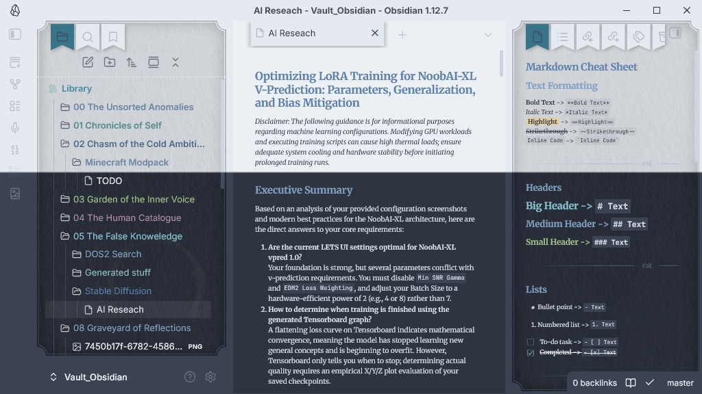

# Frozen Kingdom

A magical, frost-bitten theme for Obsidian, built on the foundations of the [Fancy-a-Story](https://github.com/h-kataria/obsidian-fancy-a-story) theme.

## Features
- **Nord Palette Integration**: Every element is mathematically calculated for optimal contrast using the cold, icy colors of the Nord color palette (Polar Night, Snow Storm, Frost).
- **Two Distinct Modes**:
  - **Dark Mode**: A deep, frozen cavern aesthetic with magical glowing ink.
  - **Light Mode**: Frosted parchment aesthetic with deep, legible icy slates.
- **Enhanced Tables**: Completely overhauled table grids with perfect visibility, alternating row hovers, and precise cell highlighting (an Excel-like crosshair experience).
- **Rainbow Folders**: Unique, visible, and aesthetically pleasing folder colors based on depth/position, individually tailored for both light and dark backgrounds.

## Installation
1. Go to **Settings** > **Appearance** > **Themes** in Obsidian.
2. Click **Manage** and search for "Frozen Kingdom".
3. Click **Use**.

### Manual Installation
1. Download the `theme.css` and `manifest.json` files from the latest release.
2. Place them in your `.obsidian/themes/Frozen Kingdom/` directory.
3. Select "Frozen Kingdom" in your Obsidian Appearance settings.
