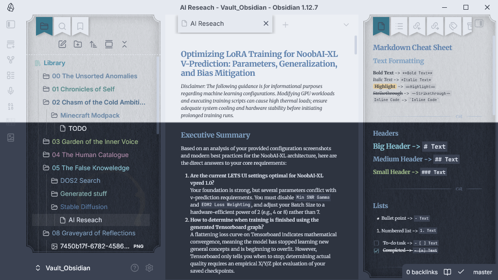

# Frozen Kingdom

A magical, frost-bitten and highly optimized theme for Obsidian, built on the foundations of the [Fancy a Story](https://github.com/ElsaTam/obsidian-fancy-a-story) theme, but drastically improved for performance and modern aesthetics.

## Features
- **Nord Palette Integration**: Every element is mathematically calculated for optimal contrast using the cold, icy colors of the Nord color palette (Polar Night, Snow Storm, Frost).
- **Two Distinct Modes**:
  - **Dark Mode**: A deep, frozen cavern aesthetic with magical glowing ink.
  - **Light Mode**: Frosted parchment aesthetic with deep, legible icy slates.
- **Premium Windows 11 / Material Design UI**: Modernized interactive elements with perfectly calibrated rounded corners (`6px - 12px`), elegant translucent 1px borders, and smooth "lift" box-shadow transitions on hover.
- **Native Font Inheritance**: Stripped out stubborn hardcoded CSS overrides. The theme now fully natively respects your Obsidian Appearance font choices without fighting you.
- **Recursive Rainbow Folders**: Aesthetically pleasing folder colors based on depth/position, where subfolders seamlessly inherit their parent's color.
- **Enhanced Tables**: Completely overhauled table grids with perfect visibility, alternating row hovers, and precise cell highlighting (an Excel-like crosshair experience).

## Installation
1. Go to **Settings** > **Appearance** > **Themes** in Obsidian.
2. Click **Manage** and search for "Frozen Kingdom".
3. Click **Use**.

### Manual Installation
1. Download the `theme.css`, `publish.css`, and `manifest.json` files from the latest release.
2. Place them in your `.obsidian/themes/Frozen Kingdom/` directory.
3. Select "Frozen Kingdom" in your Obsidian Appearance settings.

## License and Attribution
This theme is a fork of [Fancy a Story](https://github.com/ElsaTam/obsidian-fancy-a-story) by [ElsaTam](https://github.com/ElsaTam). 

In accordance with the copyleft requirements of the original theme, **Frozen Kingdom** is licensed under the **GNU General Public License v3 (GPLv3)**. Please see the [LICENSE](LICENSE) file for the full text.

